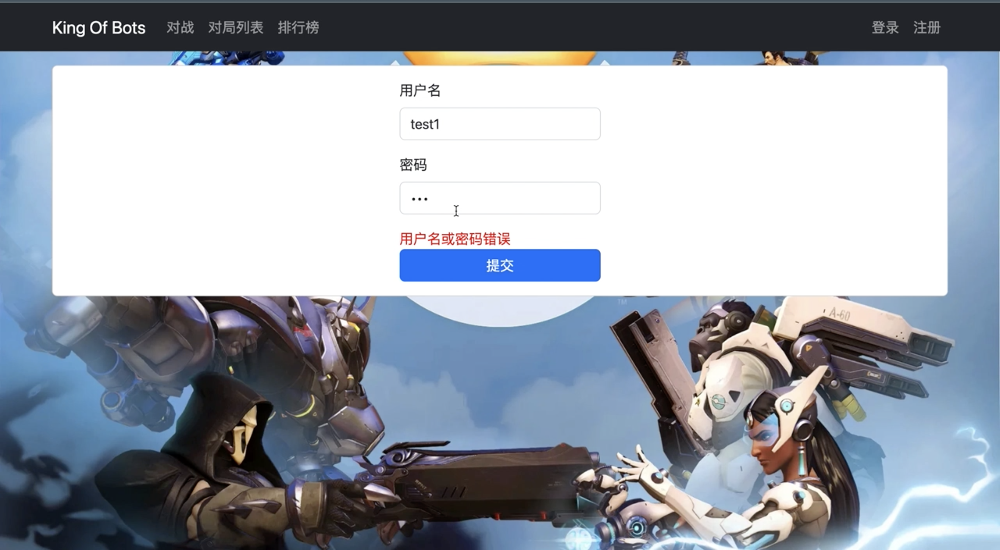
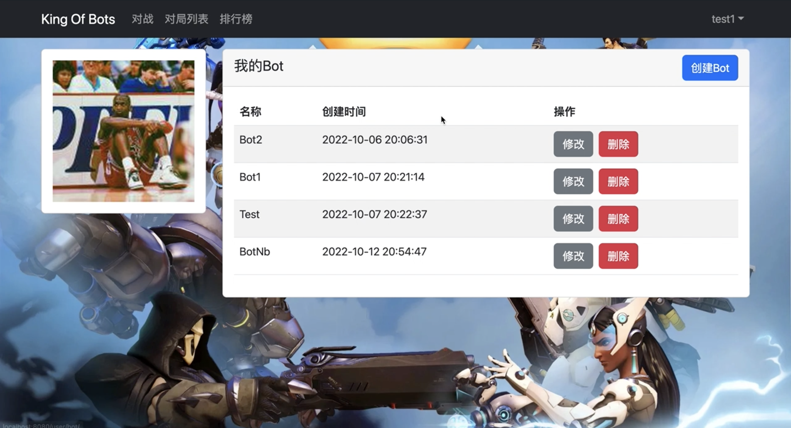
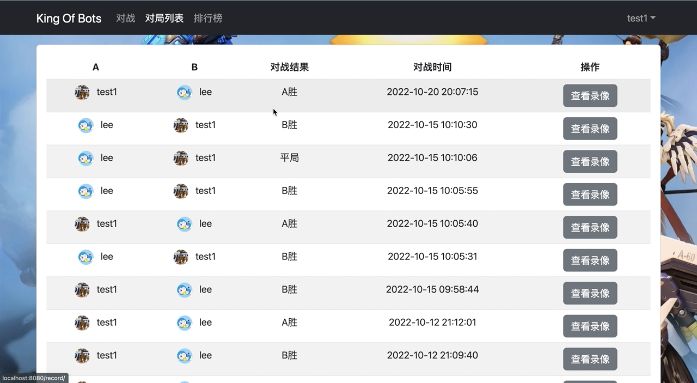
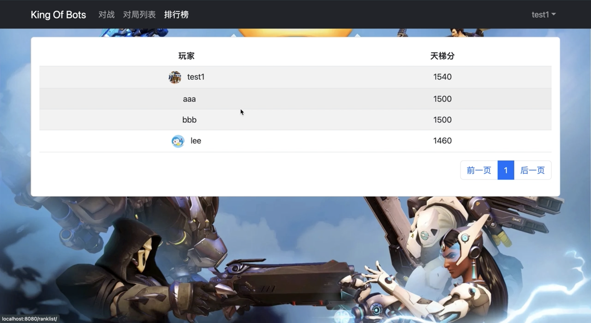
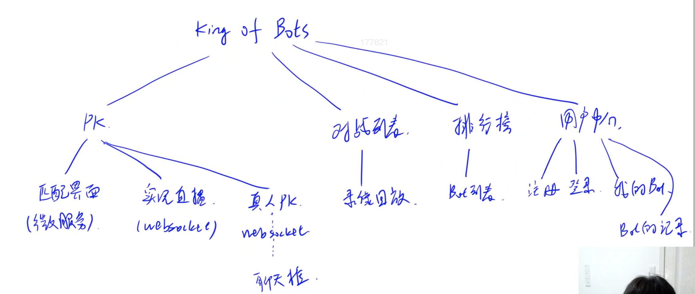
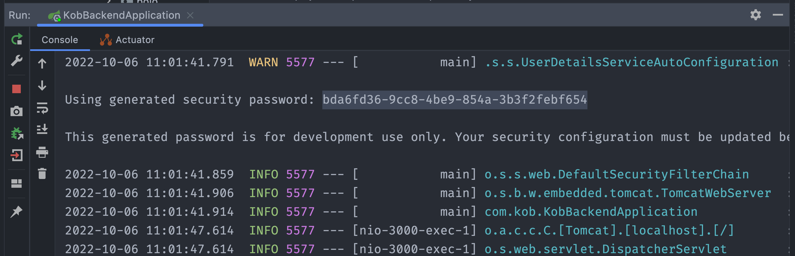
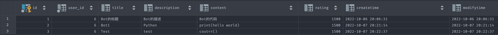

# King Of Bots

项目运行展示：

</img>












## [1]项目简介



→项目包含的模块

​	PK模块：匹配界面（微服务）、实况直播界面（WebSocket协议）

​	对局列表模块：对局列表界面、对局录像界面

​	排行榜模块：Bot排行榜界面

​	用户中心模块：注册界面、登录界面、我的Bot界面、每个Bot的详情界面

→前后端分离模式

​	SpringBoot实现后端

​	Vue3实现Web端和AcApp端

ps:先点开始匹配的在左下角

## [2]创建菜单与游戏界面

1、把所有游戏对象都存下


在components下定义 PlayGround.vue GameMap.vue


2、写成迭代函数 每一帧都执行

定义在基类GameObject中

```javascript
const GAME_OBJECT = [];

export class GameObject{
    constructor() {
        GAME_OBJECT.push(this);
        this.has_called_start = false;
        this.timedelta = 0;
    }

    start() {
    }

    update() { 
    }

    on_destory() {
    }

    destory() {
        this.on_destory();

        for(let i in GAME_OBJECT){
            const obj = GAME_OBJECT[i];
            if(obj === this){
                GAME_OBJECT.splice(i);
                break; 
            }
        }
    }
}

let last_timestep;
const step = timestamp => {
    for(let obj of GAME_OBJECT){
        if(!obj.has_called_start){
            obj.has_called_start = true;
            obj.start();
        }
        else{
            obj.timedelta = timestamp - last_timestep;
            obj.update();
        }
    }
    last_timestep = timestamp;
    requestAnimationFrame(step);
}
requestAnimationFrame(step);
```

3、相对距离 + 剧中

```javascript
<template>
    <div class="playground">
        <GameMap />
    </div>
</template>

<script>
    import GameMap  from "./GameMap.vue";
    export default{
        components: {
            GameMap,
        }
    }
</script>

<style scoped>
    div.playground {
        width: 60vw;
        height: 70vh;
        margin: 50px auto;
    }
</style>
```

4、游戏画到canvas画布里 + 创建游戏对象，调整css属性

```javascript
<template>
    <div ref="parent" class="gamemap">
        <canvas ref="canvas"></canvas>
    </div>
</template>


<script>
    import { GameMap } from "@/assets/scripts/GameMap";
    import { ref, onMounted } from "vue";

    export default{
        setup() {
            let parent = ref(null);
            let canvas = ref(null);

            onMounted(() => {
                new GameMap(canvas.value.getContext('2d'), parent.value)
            });

            return {
                parent,
                canvas,
            }
        }
    }
</script>


<style scoped>
    div.gamemap {
        width: 100%;
        height: 100%;
        display: flex;
        justify-content: center;
        align-items: center;
    }
</style>
```

5、处理格子+ canvas坐标系

```javascript
//调整对战区域为符合GameMap的最小正方形
update_size(){
        this.L = parseInt(Math.min(this.parent.clientWidth / this.cols, this.parent.clientHeight / this.rows) );
        this.ctx.canvas.width = this.L * this.cols;
        this.ctx.canvas.height = this.L * this.rows;
    }

    update() {
        this.update_size();
        this.render();
    }

    render() {
      //小矩形颜色
        const color_even = "#AAD751", color_odd = "#A2D149";
        for(let r = 0; r < this.rows; r++){
            for(let c = 0; c < this.cols; c++){
                if((r+c) % 2 == 0){
                    this.ctx.fillStyle= color_even;
                }
                else{
                    this.ctx.fillStyle = color_odd;
                }
                this.ctx.fillRect(c * this.L, r * this.L, this.L, this.L);
            }
        }
    }
```

6、设置 围墙 and 障碍物 + 轴线对称

为了消除浮点数的影响，调整update_size()函数

```javascript
update_size(){
        this.L = parseInt(Math.min(this.parent.clientWidth / this.cols, this.parent.clientHeight / this.rows) );
        this.ctx.canvas.width = this.L * this.cols;
        this.ctx.canvas.height = this.L * this.rows;
}
```

创建围墙函数

```javascript
		create_walls() {
        const g = [];
        for(let r = 0; r < this.rows; r++){
            g[r] = [];
            for(let c = 0; c < this.cols; c++)
                g[r][c] = false;
        }
        //轴对称设置 随机障碍物
        for(let i = 0; i < this.innner_wall_count; i++){
            for(let j = 0; j < 1000; j++){
                let r = parseInt(Math.random() * this.rows);
                let c = parseInt(Math.random() * this.cols);
                if(g[r][c] || g[c][r])
                    continue;
                if((r == this.rows-2 && c == 1) || (r == 1 && c == this.cols - 2))
                    continue;
                g[r][c] = g[c][r] = true;
                break;
            }
        }
				
  			//设置四周墙体
        for(let r = 0; r < this.rows; r++)
            g[r][0] = g[r][this.cols-1] = true;
        for(let c = 0; c < this.cols; c++)
            g[0][c] = g[this.rows-1][c] = true;

        //将内部随机墙体 + 四周墙体 展示出来
        for(let r = 0; r < this.rows; r++){
            for(let c = 0; c < this.cols; c++){
                if(g[r][c])
                    this.walls.push(new Wall(r, c, this));
            }
        }
        return true;
    }
```

7、保证连通 使用 Flood-Fill 算法

```javascript
//在GameMap.js中实现函数
	check_connectivity(g, sx, sy, tx, ty) {
        if(sx == tx && sy == ty)
            return true;
        g[sx][sy] = true;

        let dx = [-1, 0, 1, 0], dy = [0, 1, 0, -1];
        for(let i = 0; i < 4; i++){
            let x = sx + dx[i], y = sy + dy[i];
            if(!g[x][y] && this.check_connectivity(g, x, y, tx, ty))
                return true;
        }
        return false;
    }

//在create_map()中添加连通性判断
const copy_g = JSON.parse(JSON.stringify(g));
if(!this.check_connectivity(copy_g, this.rows-2, 1, 1, this.cols-2))
		return false;
```

8.为了避免两条蛇在某时刻同时进入同一格子，将地图改为长方形后，设置障碍为中心对称

this.rows = 13; this.cols = 14;

```javascript
				//随机障碍物
        for(let i = 0; i < this.innner_wall_count; i++){
            for(let j = 0; j < 1000; j++){
                let r = parseInt(Math.random() * this.rows);
                let c = parseInt(Math.random() * this.cols);
                if(g[r][c] || g[this.rows - 1 - r][this.cols - 1 - c])
                    continue;
                if((r == this.rows-2 && c == 1) || (r == 1 && c == this.cols - 2))
                    continue;
                g[r][c] = g[this.rows - 1 - r][this.cols - 1 - c] = true;
                break;
            }
        }
```

------------------------------地图部分------------------------------

------------------------------蛇部分--------------------------------

8.创建蛇的类 snake.js

定义蛇的初始状态和其他属性

```javascript
export class Snake extends GameObject{
    constructor(info, gamemap) {
        super();

        this.id = info.id;
        this.color = info.color;
        this.gamemap = gamemap;
        
        this.cells = [new Cell(info.r, info.c)];//存放蛇的身体，index=0为蛇头
        this.next_cell = null;
        this.step = 0;
        this.eps = 1e-2;

        this.speed = 5;//蛇每秒走5个格子
        this.direction = -1; //-1表示无指令， 0 1 2 3表示上右下左的移动方向
        this.status = "idle"; //静止状态 move表示移动 die表示死亡

        this.dr = [1, 0, -1, 0];//行偏移量
        this.dc = [0, 1, 0, -1];//列偏移量

        this.eye_direction = 0;
        if(this.id === 1)
            this.eye_direction = 2;

        this.eye_dx = [
            [-1, 1],
            [1, 1],
            [1, -1],
            [-1, -1]
        ];
        this.eye_dy = [
            [-1, -1],
            [-1, 1],
            [1, 1],
            [-1, 1]
        ];
    }
}
```

9.实现移动+蛇长度增加判断

```javascript

```

10.优化蛇身

```javascript

```

11.增加碰撞检测 即死亡判定

```js
if(!this.gamemap.check_valid(this.next_cell)){
  this.status = "die";
}
```

12.添加蛇眼睛

```js
ctx.fillStyle = "black";
for(let i = 0; i < 2; i++){
  const eye_x = (this.cells[0].x + this.eye_dx[this.eye_direction][i] * 0.15) * L;
  const eye_y = (this.cells[0].y + this.eye_dy[this.eye_direction][i] * 0.15) * L;
  ctx.beginPath();
  ctx.arc(eye_x, eye_y, L * 0.05, 0, Math.PI * 2);
  ctx.fill();
}
```


## [3]MySql数据库与注册登录

#### (1)mysql命令行指令

​	(1-1)mysql服务的关闭与启动（默认开机自动启动，如果想手动操作，可以参考如下命令）
​		关闭：net stop mysql80
​		启动：net start mysql80
(1-2)mysql的常用操作
​	连接用户名为root，密码为123456的数据库服务：mysql -uroot -p123456
​	show databases;：列出所有数据库
​	create database kob;：创建数据库
​	drop database kob;：删除数据库
​	use kob;：使用数据库kob
​	show tables;：列出当前数据库的所有表
​	create table user(id int, username varchar(100))：创建名称为user的表,表中包含id和username两个属性。
​	drop table user;：删除表
​	insert into user values(1, 'yxc');：在表中插入数据
​	select * from user;：查询表中所有数据
​	delete from user where id = 2;：删除某行数据

#### (2)配置后端环境

(2-1)在pom.xml文件中添加依赖：
	Spring Boot Starter JDBC
	Project Lombok
	MySQL Connector/J
	mybatis-plus-boot-starter
	mybatis-plus-generator

(2-2)在application.properties中添加数据库配置：

```properties
spring.datasource.username=root
spring.datasource.password=123456
spring.datasource.url=jdbc:mysql://localhost:3306/kob?serverTimezone=Asia/Shanghai&useUnicode=true&characterEncoding=utf-8
spring.datasource.driver-class-name=com.mysql.cj.jdbc.Driver
```

(2-3)SpringBoot中的常用模块

​	pojo层：将数据库中的表对应成Java中的Class

​	mapper层（也叫Dao层）：将pojo层的class中的操作，映射成sql语句

​	service层：写具体的业务逻辑，组合使用mapper中的操作

​	controller层：负责请求转发，接受页面过来的参数，传给Service处理，接到返回值，再传给页面

(2-4)spring-security

maven添加 spring-boot-starter-security，该模块自带 login\logout组件

​	发现访问controller对应的页面需要登录：


​	此处默认用户名为 'user' 密码每次随机生成可在idea输出中看到 



​	为可以使用自己数据库中的用户进行security登录，实现service.impl.UserDetailsServiceImpl类，继承自UserDetailsService接口，用来接入数据库信息，同时创建实现类 UserDetailsImpl

```java
package com.kob.service.Impl;

@Service
public class UserDetailsServiceImpl implements UserDetailsService {
    @Autowired
    UserMapper userMapper;

    @Override
    public UserDetails loadUserByUsername(String username) throws UsernameNotFoundException {
        QueryWrapper<User> queryWrapper = new QueryWrapper<>();
        queryWrapper.eq("username", username);
        User user = userMapper.selectOne(queryWrapper);
        if(user == null)
            throw new RuntimeException("用户不存在");

        return new UserDetailsImpl(user);
    }
}
```

```java
package com.kob.service.Impl.utils;

@Data
@AllArgsConstructor
@NoArgsConstructor
public class UserDetailsImpl implements UserDetails {
    private User user;

    @Override
    public Collection<? extends GrantedAuthority> getAuthorities() {
        return null;
    }

    @Override
    public String getPassword() {
        return user.getPassword();
    }

    @Override
    public String getUsername() {
        return user.getUsername();
    }

    @Override
    public boolean isAccountNonExpired() {
        return true;
    }

    @Override
    public boolean isAccountNonLocked() {
        return true;
    }

    @Override
    public boolean isCredentialsNonExpired() {
        return true;
    }

    @Override
    public boolean isEnabled() {
        return true;
    }
}
```

​	实现config.SecurityConfig类，用来实现用户密码的加密存储

```java
package com.kob.config;

@Configuration
@EnableWebSecurity
public class SecurityConfig {

    @Bean
    public PasswordEncoder passwordEncoder() {
        return new BCryptPasswordEncoder();
    }
}

```

(2-5)jwt验证

优点：不需要跨域、不需要在服务区端存储

​	pom.xml中添加3个依赖：
​		jjwt-api、jjwt-impl、jjwt-jackson

​	创建3个工具类：

​		实现utils.JwtUtil类，为jwt工具类，用来创建、解析jwt token

​		实现config.filter.JwtAuthenticationTokenFilter类，用来验证jwt token，如果验证成功，则将User信息注入上下文中

​		配置config.SecurityConfig类，放行登录、注册等接口

#### (3) 业务逻辑

(3-1) 登录注册

​	(3-1-1) 实现/user/account/token/：验证用户名密码，验证成功后返回jwt token（令牌）, service.user.account中LoginService, service.impl.user.account中LoginServiceImpl, controller.user.account中LoginController

​	(3-1-2) 实现/user/account/info/：根据令牌返回用户信息, service.user.account中LoginService, service.impl.user.account中LoginServiceImpl, controller.user.account中LoginController

​	(3-1-3) 实现/user/account/register/：注册账号, service.user.account中RegisterService, service.impl.user.account中RegisterServiceImpl, controller.user.account中RegisterController

​	(3-1-4) 在router/index.js中添加以上三个页面的路由

```javascript
{
    path: "/user/bot/",
    name: "user_bot_index",
    component: UserBotIndex,
    meta: {
      requestAuth: true,
    }
  },
  {
    path: "/user/account/login/",
    name: "user_account_login",
    component: UserLoginView,
    meta: {
      requestAuth: false,
    }
  },
  {
    path: "/user/account/register/",
    name: "user_account_register",
    component: UserRegisterView,
     meta: {
      requestAuth: false,
    }
  },
```

在views/user/account下实现UserLoginView.vue UserRegisterView.vue 对应注册、登录界面


(3-2) 前端拦截器，避免不注册/登录也可以访问其他页面

​	在router/index.js中 对每个路由添加属性

```javascript
meta: {
  requestAuth: true,
}
```

true代表未登录无法访问


(3-3) 登录状态持久化

​	当我们的用户重定向到登陆页面的时候,我们可以事先判断一下他们有没有将token存在本地：如果存在本地就把token取出来,验证一下是否过期；如果没有过期，用户就不需要重新登陆了,可以直接跳转到首页
​	刷新之后其实是一个未登录状态,自动先跳到我们的登录页面，先从本地把我们的token取出来,发现token存在把token更新到我们的内存当中,然后再从云端请求下这个用户的信息；如果可以请求的信息表示我们的token，是有效的，表示用户是登录的，我们就可以跳转到首页

```javascript
const jwt_token = localStorage.getItem("jwt_token");
if (jwt_token) {
  store.commit("updateToken", jwt_token);
  store.dispatch("getinfo", {
    success() {
      router.push({ name: "home" });
      store.commit("updatePullingInfo", false);
    },
    error() {
      store.commit("updatePullingInfo", false);
    },
  });
} else {
  store.commit("updatePullingInfo", false);
}
```

(3-4) 刷新页面时 闪烁登录页面处理+右上角处理

​	在user.js中增加pulling_info: true, //是否正在拉取信息 属性

```javascript
mutations: {
  updateUser(state, user) {
    state.id = user.id;
    state.username = user.username;
    state.photo = user.photo;
    state.is_login = user.is_login;
  },
    updateToken(state, token) {
      state.token = token;
    },
      logout(state) {
        state.id = "";
        state.username = "";
        state.photo = "";
        state.token = "";
        state.is_login = false;
      },
        updatePullingInfo(state, pulling_info){
          state.pulling_info = pulling_info;
        }
},
```


## [4]创建个人中心模块

#### (4-1) 创建数据库 + 实体类

​	在数据库增加表 bot



表中包含的列：

id: int：非空、自动增加、唯一、主键
user_id: int：非空
注意：在pojo中需要定义成userId，在queryWrapper中的名称仍然为user_id
title: varchar(100)
description: varchar(300)
content：varchar(10000)
rating: int：默认值为1500
createtime: datetime
pojo中定义日期格式的注解：@JsonFormat(pattern = “yyyy-MM-dd HH:mm:ss”)
modifytime: datetime
pojo中定义日期格式的注解：@JsonFormat(pattern = “yyyy-MM-dd HH:mm:ss”)

```java
package com.kob.pojo;

@Data
@AllArgsConstructor
@NoArgsConstructor
public class Bot {
    @TableId(type = IdType.AUTO)
    private Integer id;
    private Integer userId;
    private String title;
    private String description;
    private String content;
    private Integer rating;
    @JsonFormat(pattern = "yyyy-MM-dd HH:mm:ss", timezone = "Asia/Shanghai")
    private Date createtime;
    @JsonFormat(pattern = "yyyy-MM-dd HH:mm:ss", timezone = "Asia/Shanghai")
    private Date modifytime;
}
```

#### (4-2) 实现后端增删改查API

​	(4-2-1) /user/bot/add/：创建一个Bot, service.user.bot中AddService, service.impl.user.bot中AddServiceImpl, controller.user.bot中AddController

​	(4-2-2) /user/bot/remove/：删除一个Bot, service.user.bot中RemoveService, service.impl.user.bot中RemoveServiceImpl, controller.user.bot中RemoveController

​	(4-2-3) /user/bot/update/：修改一个Bot, service.user.bot中UpdataService, service.impl.user.bot中UpdataServiceImpl, controller.user.bot中UpdataController

​	(4-2-4) /user/bot/getlist/：查询Bot列表, service.user.bot中GetListService, service.impl.user.bot中GetListServiceImpl, controller.user.bot中GetListController

(4-3) 个人信息中Bot展示前端

1、获取头像+获取Bot列表
2、对接获取Bot信息+渲染到前端
3、实现创建一个Bot
4、前端进行对接插入Bot
5、实现创建成功关闭和清空
6、修改时间
7、实现删除按钮
8、安装依赖：vue3-ace-editor


## [5]实现微服务：匹配系统

(5-1) 添加依赖

(5-2) jwt验证

(5-3) 匹配系统-简易测试版

(5-4) 将随机生成地图移动至后端

(5-5) 创建数据库 record

(5-6) 三个棋盘间的通信与同步


## [6]实现微服务：Bot代码的执行

(6-1) 后端环境

​	创建新微服务模块

​	添加依赖

​	创建Service和Controller

(6-2) 前端修改

​	修改前端代码，增加选择按钮

(6-3) 


## [7]创建对战列表与排行榜


## [8]项目上线


## [9]App端


